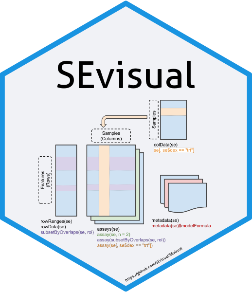

# SEvisual

[](https://cran.r-project.org/package=bslib)





SEvisual provides an interactive visualization shiny-based App for exploring data stored in [`SummarizedExperiment`](https://bioconductor.org/packages/release/bioc/html/SummarizedExperiment.html) object, currently supporting heatmap and MDS/PCA plot.

- Interactive visualization
    - Use [ComplexHeatmap](https://bioconductor.org/packages/release/bioc/html/ComplexHeatmap.html) and [plotly](https://plotly.com/r/) to create heatmap and MDS/PCA plot respectively

- Modern UI
    - The UI is built with [bslib](https://cran.r-project.org/web/packages/bslib/index.html), which is a Bootstrap 5 theme for shiny. It is a modern, clean and highly customizable theme for shiny applications

- Handling of missing values (NA)
    - deletion or K-nearest neighbors (KNN) imputation using [impute](https://www.bioconductor.org/packages/release/bioc/html/impute.html)

- Mandatory clustering
    - When encountering the error "NA/NaN/Inf in foreign function call...", [clustering is mandatory](https://github.com/jokergoo/ComplexHeatmap/issues/155).

- Support [`SummarizedExperiment`](https://bioconductor.org/packages/release/bioc/html/SummarizedExperiment.html) object as input
    - SummarizedExperiment is used to store rectangular matrices of experimental results, which is a matrix-like container where rows represent features of interest (e.g. genes, transcripts, exons, etc.) and columns represent samples

- Support data.frame as input
    - If the input data is a data.frame, it is automatically converted to a SummarizedExperiment object, assuming that all values are numeric

- Support qs file as input
    - This .qs file contains SummarizedExperiment object, which can be loaded directly into the app

- Online
    - The `SEvisual` shiny app is also hosted on the website: [SEvisual](https://sevisual.shinyapps.io/SEvisual/). (N.B. This may be slow and interrupted due to overlapping memory usage.) 


## Install
- Install Dependency Packages
``` r
    if (!requireNamespace("BiocManager", quietly=TRUE)) install.packages("BiocManager")
    packages <- c('tidyverse', "cli", "shiny", "bslib", "plotly", "qs", "SummarizedExperiment", "bsicons", 
                    "htmltools", "colourpicker", "RColorBrewer", "shinyWidgets", "waiter", "shinyalert",
                    "DT", "shinycustomloader", "GetoptLong", "kableExtra", "circlize", "impute",
                    "ComplexHeatmap", "InteractiveComplexHeatmap", "pheatmap")
    for(i in 1:length(packages)){
        if (!requireNamespace(packages[i], quietly=TRUE)) BiocManager::install(packages[i], update=FALSE)
    }
```

- Install SEvisual Package
``` r
    if (!requireNamespace("SEvisual", quietly=TRUE)) devtools::install_github("SEvisual/SEvisual")
```


## Usage
``` r
#SummarizedExperiment 
    if (!require("BiocManager", quietly=TRUE)) install.packages("BiocManager")
    BiocManager::install("airway")
    library(airway)
    data(airway)            #SummarizedExperiment with annotation
    SEvisual(airway)

#data.frame
    SEvisual(mtcars)        #automatically convert to SummarizedExperiment but without annotation
    SEvisual(iris)          #non-numeric values will be forcibly converted to numeric(eg. Species)

#data.frame convert to SummarizedExperiment with annotation
    colData <- data.frame(type=sample(c("A", "B"), ncol(mtcars), replace=TRUE))         #add annotations to columns
    rowData <- data.frame(car=rownames(mtcars))                                         #add annotations to rows
    mtcars.SE <- SummarizedExperiment(assay=mtcars, colData=colData, rowData=rowData)
    SEvisual(mtcars.SE)
```

## Get started

Since `SEvisual` covers a wide packages of uses, it has numerous getting started articles, each focusing on a particular interest:

| Package | Description |
|---|---|
| [tidyverse](https://www.tidyverse.org/) | 🍭 An opinionated collection of R packages designed for data science |
| [shiny](https://shiny.rstudio.com/tutorial/) | 🍎 Makes it easy to build interactive web applications (apps) straight from R | 
| [bslib](https://cran.r-project.org/web/packages/bslib/index.html) | 🍋 A modern UI toolkit for Shiny and R Markdown based on Bootstrap| 
| [plotly](https://plotly.com/r/) | 🍒 Makes interactive, publication-quality graphs | 
| [qs](https://cran.r-project.org/web/packages/qs/index.html) | 🍇 Quickly writing and reading any R object to and from disk | 
| [SummarizedExperiment](https://www.bioconductor.org/packages/release/bioc/vignettes/SummarizedExperiment/inst/doc/SummarizedExperiment.html) | 🍉 Store rectangular matrices of experimental results | 
| [bsicons](https://github.com/rstudio/bsicons) | 🍓 Use Bootstrap icons (as inline SVG) | 
| [htmltools](https://cran.r-project.org/web/packages/htmltools/index.html) | 🍑 Tools for HTML generation and output. | 
| [colourpicker](https://cran.r-project.org/web/packages/colourpicker/index.html) | 🍰 A colour picker tool for Shiny and for selecting colours in plots | 
| [RColorBrewer](https://cran.r-project.org/web/packages/RColorBrewer/index.html) | 🍌 color schemes for maps designed by Cynthia Brewer | 
| [shinyWidgets](https://github.com/dreamRs/shinyWidgets) | 🍬 custom widgets and other components to enhance your shiny applications | 
| [waiter](https://cran.r-project.org/web/packages/waiter/index.html) | 🍍 Full screen and partial loading screens for Shiny |
| [shinyalert](https://github.com/daattali/shinyalert) | 🌽 Easily create pretty popup messages (modals) in Shiny |
| [shinycustomloader](https://cran.r-project.org/web/packages/shinycustomloader/index.html) | 🍅 A custom css/html or gif/image file for the loading screen in R shiny | 
| [DT](https://rstudio.github.io/DT/) | 🍩 An R interface to the DataTables library | 
| [ComplexHeatmap](https://jokergoo.github.io/ComplexHeatmap-reference/book/) | 🍧 Make complex heatmaps | 


## Getting help

There are two main places to get help with `SEvisual`:

- The [github](https://github.com/SEvisual/SEvisual) is a friendly place to ask any questions and report issues/bugs

- send email to sevisual@163.com


